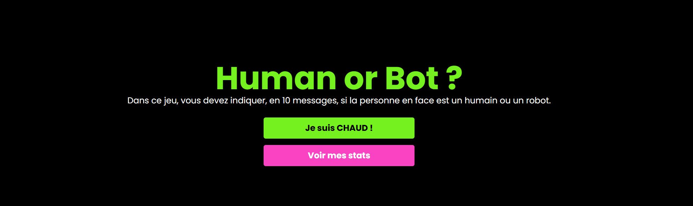

# Human or Bot 🤖👤

Une imitation de Human Or Not, ce jeu vous permet de jouer contre un utilisateur ou un bot. Le but est de deviner si la personne avec qui vous parlez est un humain ou un bot avec 10 messages maximums.

## Sommaire 📑

- [Prérequis 📋](#prérequis-)
  - [Ollama 🧠](#ollama-)
  - [MongoDB 🗄️](#mongodb-)
    - [MongoDB Compass 🧭](#mongodb-compass-)
    - [MongoDB Atlas ☁️](#mongodb-atlas-)
- [Installation ⚙️](#installation-)
  - [Backend 🖥️](#backend-)
  - [Frontend React 🌐](#frontend-react-)
  - [React Native 📱](#react-native-)
- [Auteur ✍️](#auteur-)
- [Inspiration 💡](#inspiration-)
- [Formateur 🎓](#formateur-)

## Prérequis 📋

### Ollama 🧠

Pour jouer contre un bot, vous devez d'abord installer Ollama. Ollama permet de télécharger des modèles d'IA et d'interagir avec eux. Téléchargez Ollama via le lien suivant :

[Ollama Download](https://ollama.com/download)

Une fois installé, téléchargez un modèle. Rendez-vous sur le lien suivant : [Ollama Library](https://ollama.com/library) et choisissez un modèle. Par défaut, l'application utilise le modèle `deepseek-r1`. Pour l'installer, ouvrez un terminal et exécutez la commande suivante :

```sh
ollama run deepseek-r1
```

Vous pouvez ensuite fermer le terminal. Si vous avez installé un modèle différent, vous devrez modifier le fichier d'environnement du backend.

### MongoDB 🗄️

Le backend utilise MongoDB. Vous avez deux options pour utiliser votre base de données.

#### MongoDB Compass 🧭

Téléchargez MongoDB Compass pour héberger une base de données MongoDB en local et lancer l'application. Le lien de téléchargement est le suivant :
[MongoDB Compass Download](https://www.mongodb.com/products/tools/compass)

#### MongoDB Atlas ☁️

MongoDB Atlas est une base de données hébergée par MongoDB, offrant un accès facile. Un cluster gratuit peut être créé pour héberger les données des utilisateurs. Vous pouvez créer votre cluster gratuit ici :

[MongoDB Atlas](https://www.mongodb.com/fr-fr/products/platform/atlas-database)

## Installation ⚙️

### Backend 🖥️

```sh
npm install
```

Modifiez votre fichier `.env` pour y inclure :

```
MONGO_URL="URL_DE_VOTRE_BDD"
PORT="PORT_DU_SERVEUR"
PORT_WS="PORT_DU_WEBSOCKET"
JWT_SECRET="CLE_CHIFFREMENT_JWT"
OLLAMA_MODEL="MODEL_OLLAMA"
```

Pour lancer le backend :

```sh
npm run dev
```

### Frontend React 🌐

```sh
npm install
```

Modifiez le fichier `.env` pour y inclure :

```
VITE_API_BASE_URL="URL_BACKEND_SERVEUR"
VITE_WEBSOCKET_BASE_URL="URL_BACKEND_WEBSOCKET"
```

Pour lancer le frontend React :

```sh
npm run dev
```

### React Native 📱

```sh
npm install
```

Modifiez le fichier `.env` pour y inclure :

```
API_BASE_URL="URL_BACKEND_SERVEUR"
WEBSOCKET_BASE_URL="URL_BACKEND_WEBSOCKET"
```

Pour lancer l'application React Native :

```sh
npm run android
```

ou

```sh
npm run ios
```

ou

```sh
npm run web
```

## Auteur ✍️

SwerkF

## Inspiration 💡

[Human or Not](https://humanornot.ai/)

## Formateur 🎓

Christopher LOISEL
